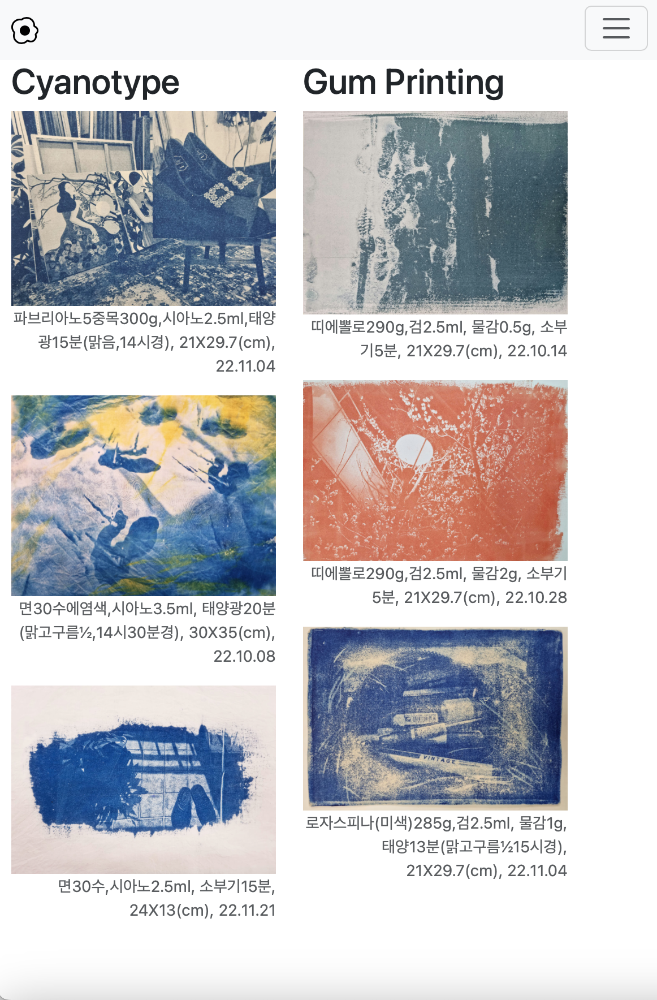
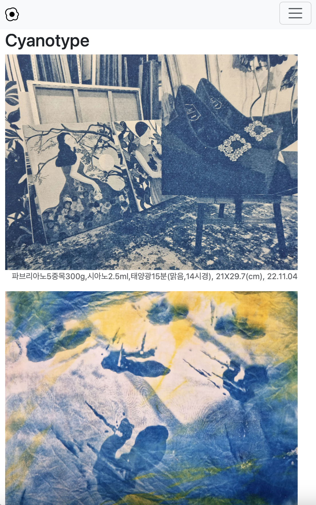
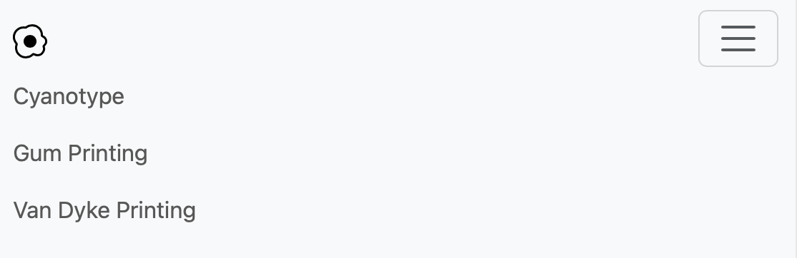

# classic print site

**Classic Print**는 고전 사진 인화 기법(Cyanotype, Gum Printing, Van Dyke Printing)으로 제작한 작품을 소개하는 웹사이트입니다.

---

## 📌 classic print란?

프린터가 없던 시절, **빛과 화학 용액의 반응을 이용해 이미지를 현상하는 방식**이 존재했습니다. 이를 **고전 프로세스(Classic Print)**라고 하며, 대표적인 기법으로는 다음이 있습니다:

- **Cyanotype** – 흔히 "청사진을 그리다"의 어원이 되는 기법
- **Gum Printing**
- **Van Dyke Printing**

이 사이트는 이러한 고전 인화 기법으로 제작한 사진 작품을 웹상에서 감상할 수 있도록 구성되었습니다.

---

## 💡 사이트 주요 특징

### 반응형 디자인 지원

- 화면 크기에 따라 레이아웃이 자동으로 조정됩니다.  
  예를 들어, 넓은 화면에서는 다단 구성 / 좁은 화면에서는 단일 열로 전환됩니다.

  

### 내비게이션 기능

- 상단 헤더의 탭을 클릭하면 각 고전 인화 기법 섹션으로 이동합니다.

---

## 웹 사이트 구성 및 구현

- **Bootstrap 5** 기반으로 제작하였으며, 주요 구성은 다음과 같습니다

  - **Navbar**: 섹션 이동 버튼
  - **Main Section**: 각 인화 기법별 이미지 및 설명
  - **Footer**: 제작자 정보 표기

- 반응형 기능은 Bootstrap의 **그리드 시스템(col-12, col-md-6 등)**과 **유틸리티 클래스**를 사용해 구현했습니다.

---

## 느낀점

부트스트랩에는 생각보다 많은 기능이 내장되어 있으며,  
이러한 기능들을 **문서에서 직접 찾아보고 응용하는 능력의 중요성**을 느꼈습니다.  
기초적인 레이아웃 설계와 반응형 구조에 대해 실습하며 더욱 익숙해질 수 있었습니다.
